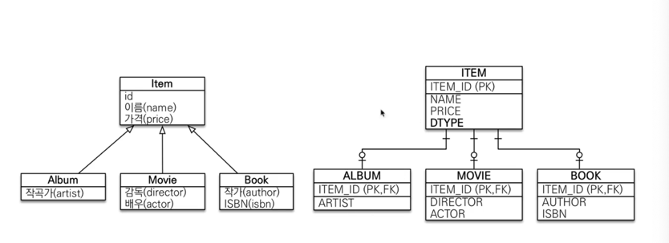
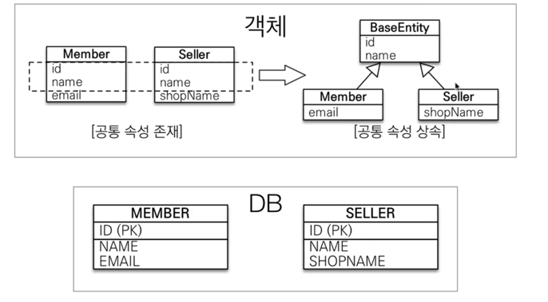

# 고급 매핑 - 상속 관계 매핑
- 객체는 상속관계는 있지만 데이터베이스는 없다.
- 상속관계 매핑: 객체의 상속과 구조와 DB의 슈퍼타입 서브타입 관계를 매핑
- ex) 물품 안에 음반, 영화, 책
- JPA를 사용하면 어노테이션 strategy만 바꾸면 된다!
## 조인 전략 - 기본 전략으로 가져가야한다.

- DTYPE을 두어서 구분을 한다
- @Inheritance(strategy = InheritanceType.JOINED)
- @DiscriminatorType(name="")
  - 디폴트로 엔티티 이름이 들어간다?
- 자식클래스에선 @DiscriminatorValue("A"), 기본은 엔티티 이름
- PK면서 FK인 id가 생성된다.
---
- 장점: 정규화 되어있고, 제약조건을 아이템에 다 걸 수 있다. ITEM 테이블만 보면 된다.
- 단점: 조회시 조인을 많이 사용, 성능 저하, 조회 쿼리 복잡, INSERT 쿼리도 두번 호출
## 단일 테이블 전략
- @Inheritance(strategy = InheritanceType.SINGLE_TABLE)
- 하나로 다 합치는 것, 나머지는 null
- 여기도 DTYPE을 둔다.
- 하이버네이트 기본 전략임
- 성능이 가장 좋다, 그냥 정말 단순할 때 단일테이블 전략을 선택
---
- 장점: 조인 필요 없어서 성능 굿, 조회 쿼리 굿
- 단점: 자식 엔티티가 매핑한 컬럼은 모두 null을 허용해야 한다.
- 테이블이 커질 수 있고, 오히려 조회 성능이 느려질 수 있다.

## 구현 클래스마다 테이블 전략
- 아이템 속성을 없앤다.
- 비효율적, 왜냐하면 id만 알면 앨범, 영화, 책 테이블을 모두 되져보아야 한다.
- 결론: 이거는 쓰면 안 되는 전략

## @MappedSuperClass

- 객체에서 공통 매핑 정보가 필요할 때 사용
```java
private String createdBy;
private LocalDateTime createdDate;
//등등..
```
- 이런 것들이 중복될 때 BaseEntity.java를 상속
- BaseEntity에 @MappedSuperClass를 넣는다.
- @Column 을 이용하면 다같이 바뀐다.
- 나중에 이벤트라는 것으로 제공하는 어노테이션으로 쉽게 만들 수 있다.
- 이건 상속관계 매핑도 아니고, 엔티티도 아니고(쿼리 안나감), 테이블과 매핑이 안된다.
- 당연히 조회 불가
- public abstract으로 추상 클래스로 만드는 것을 권장한다.