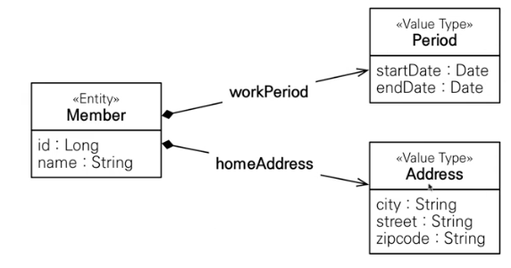
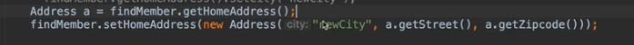
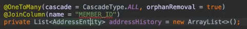

# 값타입
- 엔티티 타압: 식별자로 추적 가능
- 값 타입: 식별자가 없고 값만 있음
## 기본값 타입
- 자바 기본타입, 래퍼 클래스, String
- 생명 주기를 엔티티에 의존
- 값 타입은 공유하면 안된다. int, double은 공유되지 않는다 = 불변 객체다
## 임베디드 타입

- @Embeddavle, @Embedded
- 재사용, 높은 응집도
- 모든 값 타입은 엔티티에 생명 주기를 의존한다.
- 쓰나 안 쓰나 매핑하는 테이블은 같다. 중요!
- 세밀하게 가능하다. 임베디드 만들고, 그 안에 세부 메서드를 만들 수 있음(재직 중? 좌표 뽑기 같은)
- 잘 설계 한 ORM어플리케이션은 매핑한 테이블 수보다 클래스 수가 더 많다!
-  
## 값 타입과 불변 객체
- 임베디드 타입이 가변 객체기 때문에 같은 임베디드 객체를 설정하면, 한 쪽에서 바꾸면 둘 다 바뀜
- 대신 값을 복사해서 사용
- 그래서 값 타입은 불변 객체로 설계해야함!
- 생성자로만 값을 설정하고 setter를 만들지 않으면 된다, Integer과 string은 불변객체

## 값 타입의 비교
- 값 타입은 인스턴스가 달라도 그 안의 값이 같다면 같은 것이다.
- 동일성 비교: 인스턴스 참조 값 비교 ==
- 동등성은 인스턴스 값을 비교 equals()

## 값 타입 컬렉션
- 관계형 데이터는 리스트, 셋을 넣을 수 없다.
- @ElementCollection, @CollectionTable(name = "") + @JoinColumn
- Cascade와 고아 객체 제거 기능이 필수로 들어 있음
- 컬렉션들은 지연 로딩이다.
- 값 타입은 업데이트 되면 통으로 바꿔야 된다.

- 값 타입 컬렉션에 변경 사항이 있으면 주인 엔티티 연관된 모든 데이터 삭제 후, 현재 값들을 다시 저장한다.
- 즉, 2개 있을 때 하나 업데이트 하면 다 없애고 두개를 인서트,, 결론은 쓰면 안된다
- 일대다 관계를 위한 엔티티를 만들고 값타입을 사용한다.
- AddressEntity 생성

- 주소 이력만 조회하는 일도 있기 때문에 엔티티로 승격시켜야 된다.
- 엔티티는 set으로 바꿔도 됨. 값 타입은 불변 객체이다. 바뀌면 큰일남